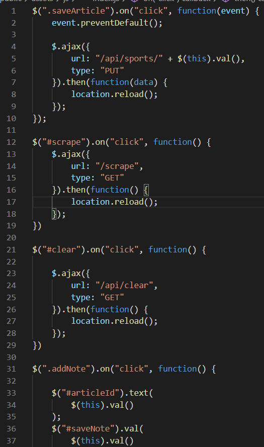
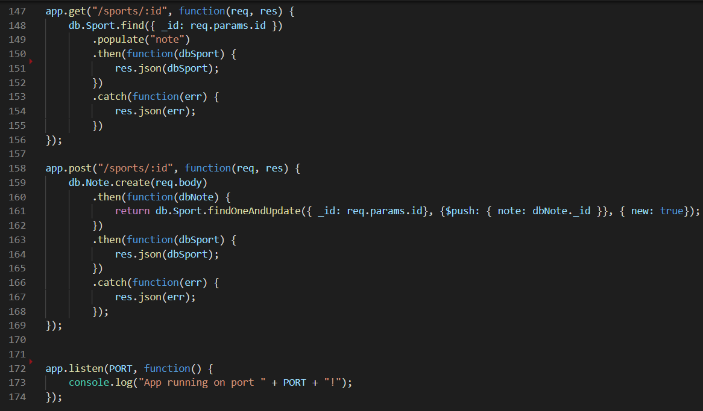

# web-scraper

## The Assignment

To design a website that lets users view and comment on recent news. The source used for this website is ESPN.com and all credit goes to them for their media content.

## How It Works

This website uses 5 npm packages: express, express-handlebars, mongoose, cheerio, and axios. Express is used to setup the server and handlebars is used to render components of the website dynamically. Axios was used to make an API call to ESPN and cheerio was used to scrape the data retrieved. This was done to get the videos and articles necessary. This data was then stored in MongoDB using Mongoose. However, mLab was used when the website had to be deployed. Two collections were created:sports and notes. The MVC filing system was also used.

## Technologies Used

Visual Studio Code, Git Bash, Heroku, MongoDB, Google Chrome

## Demo

## Code Screenshots

### Models

#### Sport.js

#### Note.js

#### index.js

### Public/Assets

#### style.css

#### index.js

### Views

#### main.handlebars

#### navbar.handlebars

#### index.handlebars

#### saved.handlebars

### server.js

